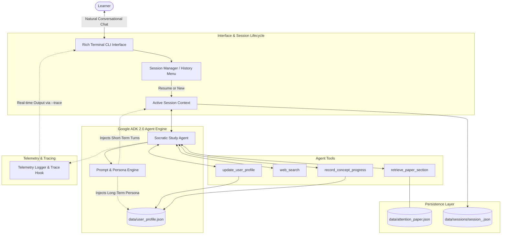

# Technical Design Document (TDD)
# Project: Socratic Technical Study Agent

| Document Metadata | Value |
| :--- | :--- |
| **Project Name** | Socratic Technical Study Agent |
| **Assignment** | AI in 5 Days Assessment Agent (Google Course) |
| **Status** | Approved / Ready for Implementation |
| **Target Evaluation** | 95 / 95 Points across all 5 Course Rubric Criteria |
| **Primary Authors** | Jesse Turner & Antigravity Pair-Programming Agent |
| **Repository Root** | `https://github.com/<user>/studyagent` (Public Root Project) |

---

## 1. Executive Summary & Problem Formulation

### 1.1. Problem Statement
When studying foundational technical literature—such as the landmark paper [*Attention Is All You Need*](https://research.google/pubs/attention-is-all-you-need/) (Vaswani et al., 2017)—readers frequently succumb to passive reading and the "illusion of competence." Without active recall, deep conceptual probing, and immediate feedback on architectural trade-offs, retaining high-dimensional mathematical intuition (e.g., query-key-value projections, softmax scaling, positional sinusoidal frequencies) is exceedingly difficult.

### 1.2. Proposed Solution
The **Socratic Technical Study Agent** is a developer-focused, command-line conversational agent built on **Google ADK 2.0** and **Gemini 2.5 Flash**. It engages the learner in a natural technical dialogue while continuously enforcing active recall through a **Socratic Clarification Loop**:
1. When the learner asks a question, the agent answers clearly and rigorously, grounded in the actual paper text.
2. The agent immediately follows up with a targeted **clarifying comprehension check** to test the learner's true understanding.
3. The agent autonomously diagnoses misconceptions, updates a persistent **Student Profile** (tracking concept mastery and personalized learning preferences), and queries modern web context (e.g., PyTorch implementations, FlashAttention, RoPE) using search tools when appropriate.
4. It maintains **Session Storage** across restarts, prompting users to resume past study sessions or start fresh.

---

## 2. System Architecture



---

## 3. Rubric Compliance Matrix (Target Score: 95 / 95)

| Evaluation Criterion | Implementation Details | Target Score |
| :--- | :--- | :---: |
| **1. Tool & Interface Design** | • 4 distinct tools with strict schemas, typing, and descriptive docstrings.<br>• Clean interactive terminal chat interface built with `rich` featuring colored Markdown, code syntax highlighting, session history prompt, and graceful exit handling. | **Max** |
| **2. Context & Memory** | • **Short-Term Memory**: Session storage retaining turn-by-turn context, saved to timestamped JSON files, with cross-session resumption.<br>• **Long-Term Memory**: Persistent `user_profile.json` capturing learning style, technical background, personality traits, and concept mastery (0–100%) updated via autonomous reflection. | **Max** |
| **3. Orchestration & Logic** | • **Google ADK 2.0** orchestration using `gemini-2.5-flash`.<br>• Core Socratic Clarification Loop: Answers user inquiry $\rightarrow$ retrieves paper grounded facts $\rightarrow$ generates targeted comprehension check $\rightarrow$ records diagnosed misconceptions. | **Max** |
| **4. Observability & Tracing** | • Centralized `telemetry.py` recording execution latency, token usage estimates, tool calls, and model reasoning steps.<br>• `--trace` CLI flag for live, transparent inspection of agent cognition during chat. | **Max** |
| **5. Infrastructure & CI/CD** | • Public root GitHub repository structure.<br>• Automated `.github/workflows/ci.yml` running `pytest` and `ruff` on every commit/PR.<br>• Deterministic unit test suite with mock LLM and search calls (runs 100% reliably in CI without API keys).<br>• Production-grade `Dockerfile`. | **Max** |

---

## 4. Component Deep Dive

### 4.1. Conversational Interface (`src/studyagent/cli.py`)
* **Startup Sequence**:
  1. Checks `data/sessions/` for existing session logs.
  2. If past sessions exist, renders a formatted table showing past dates, turns, and covered topics.
  3. Prompts the user: `[1] Resume latest session, [2] Start new session, [3] Select specific session`.
  4. If first run, launches directly with zero friction (learning user background organically).
* **Execution Loop**:
  - Uninterrupted conversational REPL (`Learner >`, `Agent >`).
  - Terminal formatting using `rich.console.Console` and `rich.markdown.Markdown`.
  - Inline indicators for background tool operations (e.g. `[dim] Retrieved Section 3.2.1: Scaled Dot-Product Attention[/dim]`).
  - Graceful exit via `exit`, `quit`, or `Ctrl+C`, triggering automatic session persistence.

### 4.2. Memory & Session Management (`src/studyagent/memory.py`)

#### A. Long-Term Memory (`data/user_profile.json`)
Maintains a living profile of the learner across all sessions:
```json
{
  "user_persona": {
    "background": "Backend software engineer, experienced in Python, intermediate in deep learning math",
    "learning_style": "Prefers concrete tensor shapes and code examples over abstract equations",
    "personality_tone": "Curious, pragmatic, focused on real-world implementation trade-offs"
  },
  "concept_mastery": {
    "architecture_overview": { "score": 85, "status": "mastered", "misconceptions": [] },
    "scaled_dot_product": { "score": 70, "status": "learning", "misconceptions": ["Confused softmax saturation with ReLU"] },
    "multi_head_attention": { "score": 40, "status": "learning", "misconceptions": ["Thought heads increase total compute proportionally"] },
    "positional_encoding": { "score": 20, "status": "unseen", "misconceptions": [] },
    "computational_complexity": { "score": 10, "status": "unseen", "misconceptions": [] }
  },
  "last_updated": "2026-09-21T06:20:00Z"
}
```

#### B. Session Storage (`data/sessions/session_<timestamp>.json`)
Stores full conversational state for the active study session:
```json
{
  "session_id": "session_20260921_062500",
  "created_at": "2026-09-21T06:25:00Z",
  "updated_at": "2026-09-21T06:35:00Z",
  "turns": [
    { "role": "user", "content": "Why did the authors use 1/sqrt(d_k) in the attention formula?" },
    { "role": "assistant", "content": "The scaling factor 1/sqrt(d_k) counteracts...", "tools_invoked": ["retrieve_paper_section"] }
  ],
  "session_summary": "Discussed scaled dot-product attention and softmax gradient vanishing."
}
```

### 4.3. Tool Ecosystem (`src/studyagent/tools.py`)

```python
def retrieve_paper_section(topic_key: str) -> dict:
    """
    Retrieves verified text excerpts, mathematical formulas, and section numbers
    from 'Attention Is All You Need' for a given concept.
    Args:
        topic_key: One of ['architecture_overview', 'scaled_dot_product', 
                           'multi_head_attention', 'positional_encoding', 'computational_complexity']
    """

def web_search(query: str) -> str:
  NOTE - "for web search use the google discovery engine https://docs.cloud.google.com/generative-ai-app-builder/docs/reference/mcp"
    """
    Performs external web search via SerpAPI or Google Custom Search to retrieve
    modern ML developments, PyTorch documentation, or contemporary papers (e.g. FlashAttention, RoPE).
    Falls back gracefully if API keys are not configured.
    """

def update_user_profile(trait_category: str, detail: str) -> str:
    """
    Autonomous reflection tool: Saves newly discovered user background, learning preferences,
    or personal traits to long-term memory (data/user_profile.json).
    Args:
        trait_category: 'background', 'learning_style', or 'personality_tone'
        detail: Description of the discovered trait.
    """

def record_concept_progress(concept_key: str, score: int, notes: str = "") -> str:
    """
    Updates the learner's mastery score (0-100) and logs any diagnosed misconceptions
    for a specific concept in long-term memory.
    """
```

### 4.4. Agent Orchestrator & Prompt Design (`src/studyagent/agent.py`)
* **Engine**: `google-adk` with `google-genai` client using `gemini-2.5-flash`.
* **System Instruction**:
  - Sets the persona of an encouraging, deeply knowledgeable peer researcher.
  - Dynamically injects the user's current long-term profile and recent session summary.
  - Mandates the **Socratic Clarification Loop**: Every detailed explanation must conclude with a targeted check question to verify understanding.
  - Instructs the model to call `update_user_profile` whenever the user shares information about their background or habits.

### 4.5. Observability & Tracing (`src/studyagent/telemetry.py`)
* Central singleton `TelemetryTracer`.
* Captures:
  - Agent turn timestamps and roundtrip latency.
  - Tool invocations (function name, arguments, execution duration, and output size).
  - Model token usage (prompt tokens, response tokens).
* If `--trace` is passed on the CLI, tool executions and execution latencies are printed live in the terminal.

---

## 5. Repository Layout & File Structure

```text
studyagent/
├── .github/
│   └── workflows/
│       └── ci.yml               # Automated GitHub Actions: pytest + ruff linting
├── data/
│   ├── attention_paper.json     # Pre-parsed paper concepts, sections & formulas
│   ├── user_profile.json        # Long-term memory profile
│   └── sessions/                # Session logs (.gitkeep)
├── src/
│   └── studyagent/
│       ├── __init__.py
│       ├── agent.py             # ADK Agent & Socratic conversational engine
│       ├── tools.py             # 4 Custom Agent Tools
│       ├── memory.py            # Session storage & user profile persistence
│       ├── telemetry.py         # Telemetry, metrics, and trace collector
│       └── cli.py               # Rich interactive terminal interface
├── tests/
│   ├── __init__.py
│   ├── test_tools.py            # Unit tests for paper retrieval & web search
│   ├── test_memory.py           # Unit tests for session and profile storage
│   └── test_agent.py            # Unit tests for conversational engine & mocking
├── Dockerfile                   # Production container definition
├── requirements.txt             # Pinned dependencies (google-adk, rich, etc.)
├── pyproject.toml               # Build system and linting configuration
├── README.md                    # Architecture, setup, video demo link & rubric mapping
├── REQUIREMENTS.md              # Scoped Product Requirements Document
└── TECHNICAL_DESIGN.md          # This technical design document
```

---

## 6. Implementation Plan & Execution Phases

1. **Phase 1: Foundation & Data Layer**
   - Initialize git repository and `.gitignore`.
   - Setup `pyproject.toml` and `requirements.txt`.
   - Create `data/attention_paper.json` with the 5 foundational concepts.
   - Implement `src/studyagent/memory.py` (Session & Profile persistence).

2. **Phase 2: Tool Ecosystem & Telemetry**
   - Implement `src/studyagent/tools.py` with the 4 tools.
   - Implement `src/studyagent/telemetry.py` for execution tracking and `--trace`.

3. **Phase 3: Agent Orchestrator & CLI Interface**
   - Implement `src/studyagent/agent.py` using Google ADK 2.0.
   - Implement `src/studyagent/cli.py` using `rich` with session history prompt and chat REPL.

4. **Phase 4: Testing & Verification**
   - Write comprehensive unit tests in `tests/` using mocked LLM and search calls.
   - Run tests locally with `pytest` and lint with `ruff`.

5. **Phase 5: CI/CD, Containerization & Documentation**
   - Create `.github/workflows/ci.yml`.
   - Create `Dockerfile`.
   - Write comprehensive `README.md` highlighting the 5 rubric criteria and providing setup instructions.
