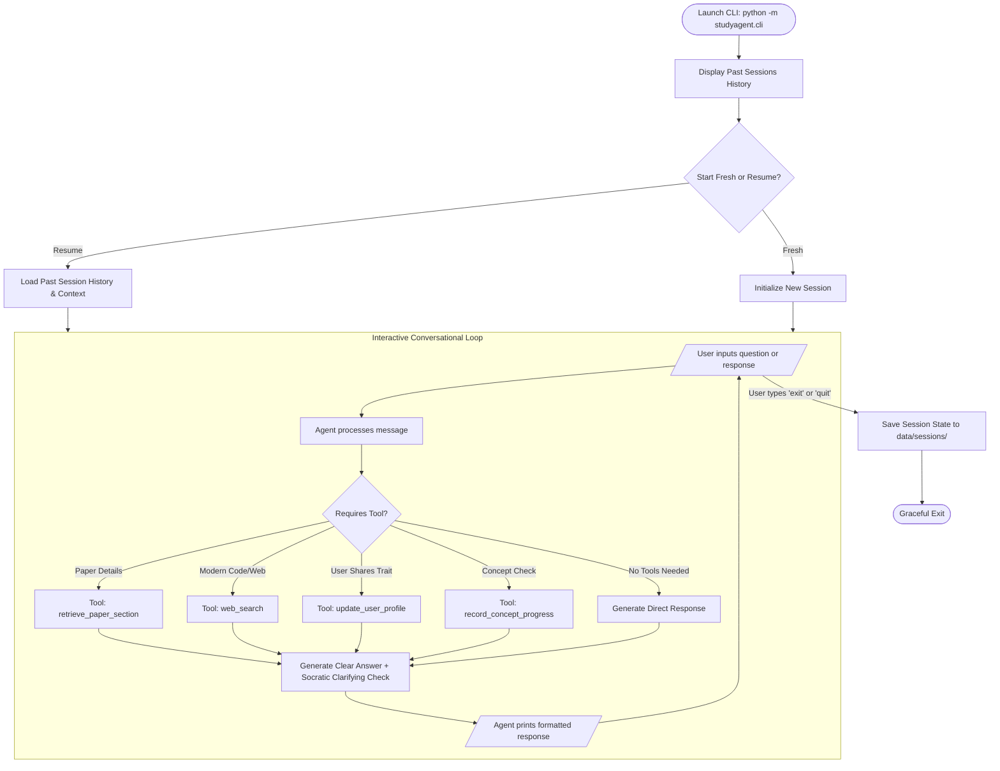

# Technical Study Agent - Product Requirements Document (PRD) & Final Architecture

## 1. Project Overview & Problem Statement
* **Problem**: When reading dense technical research papers (such as [*Attention Is All You Need*](https://research.google/pubs/attention-is-all-you-need/)), learners often struggle with active retention, understanding complex mathematical intuition, and connecting foundational papers to modern architectures.
* **Solution**: An interactive, conversational **Socratic Study Agent** running in a terminal chat interface. The agent:
  1. Carries on a natural back-and-forth conversation with the learner.
  2. Whenever the learner asks a question, the agent answers thoroughly and immediately poses a **clarifying check / Socratic follow-up question** to test comprehension and prevent passive reading.
  3. Grounds answers using a dedicated paper retrieval tool for *Attention Is All You Need*.
  4. Leverages a **Web Search Tool** using the Google Discovery Engine MCP (Model Context Protocol) endpoint (`https://discoveryengine.googleapis.com/mcp`) to look up modern context, PyTorch code, and contemporary architectures (e.g., FlashAttention, RoPE, LLaMA).
  5. Uses **Session Storage** (`data/sessions/`) to retain conversation history and presents a session selector on startup (allowing the user to resume a past session or start fresh).
  6. Employs **Long-Term Memory** via autonomous reflection (`data/user_profile.json`) to learn about the user's personality, background, learning style, and technical strengths/weaknesses over time.
* **Assignment Target**: **AI in 5 Days Assessment Agent** (Freestyle / Agents for Good - Education).
* **Evaluation Target**: Maximum score across all 5 evaluation criteria (Total: 95 pts).

---

## 2. Rubric Alignment (Max Score: 95)

| Evaluation Criterion | Implementation in Study Agent | Target Score |
| :--- | :--- | :--- |
| **1. Tool & Interface Design** | • **Tools**: `retrieve_paper_section`, `web_search`, `update_user_profile`, `record_concept_progress`. • **Interface**: Conversational chat interface (`User >` / `Agent >`) powered by `rich` with colored markdown rendering, session history menu on startup, and graceful exit. | High |
| **2. Context & Memory** | • **Session Storage**: Retains turn-by-turn context for active dialogue, persists session logs upon exit, and offers resume-on-boot. • **Long-Term Memory**: Persistent `user_profile.json` tracking learner background, personality, cognitive preferences, and historical misconceptions. Updated autonomously during natural conversation. | High |
| **3. Orchestration & Logic** | • **Google ADK 2.0** conversational workflow powered by `gemini-2.5-flash` (`GEMINI_API_KEY`).   - Dynamically routes between conversation, paper retrieval, web search, and profile reflection.   - **Socratic Clarification Dynamic**: Answers the user's query, then probes with a targeted comprehension check. | High |
| **4. Observability & Tracing** | • Integrated telemetry logger tracking tool executions, reasoning events, and latencies. • Optional `--trace` CLI flag to display real-time agent decisions and tool inputs/outputs. | High |
| **5. Infrastructure & CI/CD** | • Public root repository for straightforward cloning. • Automated GitHub Actions CI workflow running `pytest` and `ruff`. • `Dockerfile` for containerized execution. • Mock-enabled unit tests ensuring passing CI without external API keys. | High |

---

## 3. Conversational & Operational Flow

---

## 4. Key Configurations & Defaults
* **LLM Engine**: `gemini-2.5-flash` via `GEMINI_API_KEY` (Google AI Studio).
* **Search Backend**: Google Discovery Engine MCP endpoint (`https://discoveryengine.googleapis.com/mcp`) with graceful offline/mock fallback.
* **Storage Locations**:
  - `data/attention_paper.json`: Foundational paper knowledge.
  - `data/user_profile.json`: Persistent long-term user preferences & persona.
  - `data/sessions/`: Timestamped session JSON logs.
