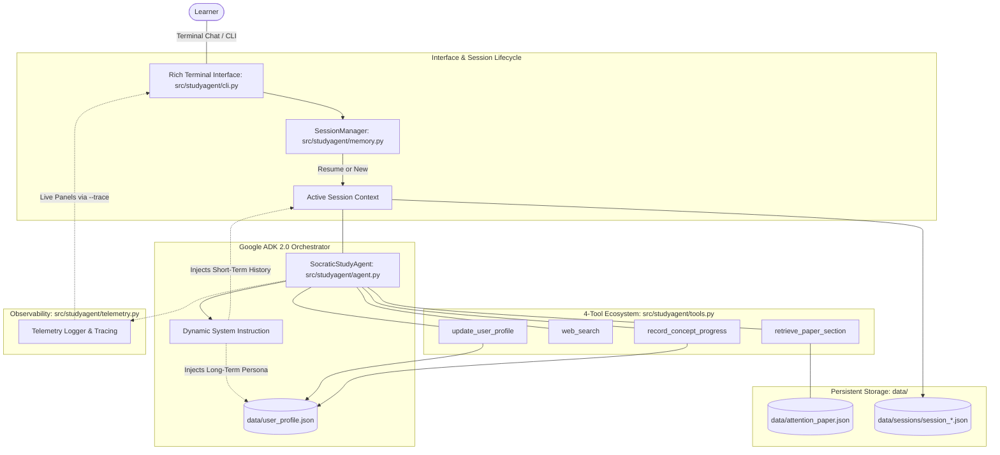

# Socratic Technical Study Agent: Complete System Walkthrough & Architectural Guide

> **Project**: Socratic Technical Study Agent  
> **Course Assessment**: AI in 5 Days Assessment Agent (Freestyle / Agents for Good - Education)  
> **Target Evaluation**: 95 / 95 Points across all 5 Course Rubric Criteria  
> **Core Framework**: Google ADK 2.0 & Gemini Flash  

---

## 1. Executive Summary & Pedagogical Vision

### 1.1 The Problem: Passive Reading & The "Illusion of Competence"
When engineers and researchers study foundational literature like [*Attention Is All You Need*](https://research.google/pubs/attention-is-all-you-need/) (Vaswani et al., 2017), they often read passively. Equations like $\text{softmax}\left(\frac{QK^T}{\sqrt{d_k}}\right)V$ appear straightforward on the page, but without active recall and technical pressure:
- Readers fail to explain **why** variance grows proportionally to $d_k$.
- Readers struggle to calculate why softmax gradients vanish (saturation).
- Readers cannot trace the tensor projections $[B, T, d_{\text{model}}] \to [B, h, T, d_k]$ in PyTorch.
- Readers cannot connect the 2017 architecture to modern solutions like FlashAttention, RoPE, or Grouped-Query Attention (GQA).

### 1.2 The Solution: Socratic Clarification Loop
The **Socratic Technical Study Agent** solves this through a continuous **Active-Recall Clarification Loop**:
1. **Never Just an Answer**: When you ask a question, the agent provides a rigorous explanation grounded directly in the paper's mathematics and PyTorch implementation.
2. **The Socratic Comprehension Check**: Every single explanation concludes with a targeted, thought-provoking question to test your active comprehension of architectural trade-offs.
3. **Autonomous Reflection**: As you chat, the agent notices your background and preferred learning style, evaluates your responses, and dynamically updates your **Student Profile** (tracking concept mastery $0-100\%$ and logging specific diagnosed misconceptions).
4. **Session Resumption**: All conversations are stored in timestamped session files, allowing you to resume past discussions or start fresh at any time.

---

## 2. System Architecture



---

## 3. Component Breakdown

### 3.1 Google ADK 2.0 Agent Engine (`src/studyagent/agent.py`)
Google released **ADK 2.0 (Agent Development Kit)** as the next-generation framework for multi-agent workflows, tool execution, and session management with Gemini.

- **`adk.Agent`**: Configured with:
  - `name`: `"socratic_study_agent"`
  - `model`: `gemini-3.5-flash` (or fallback / override via `GEMINI_MODEL`)
  - `instruction`: Dynamically generated system instruction injecting the user profile
  - `tools`: The 4 agent tools
- **`InMemoryRunner`**: Manages execution and event streaming (`runner.run_async()`).
- **Spike Resilience (Exponential Backoff)**: LLM APIs can occasionally encounter temporary 503 high-demand spikes. We built exponential backoff retries right into `send_message_stream()` so transient network hiccups never break an interactive study session.

### 3.2 Dual Memory System (`src/studyagent/memory.py`)
Learning requires both working memory (conversational context) and long-term memory (knowledge mastery):

#### A. Short-Term Memory (`data/sessions/*.json`)
- Every session is saved as a timestamped JSON file containing turn-by-turn dialogue, tool citations, and auto-updated conversational summaries.
- On startup, `prompt_session_choice()` displays a formatted table of past sessions and lets you resume any previous session or start fresh.

#### B. Long-Term Memory (`data/user_profile.json`)
- **Learner Persona**: Tracks your technical background (e.g. *"Backend systems engineer"*), learning style (e.g. *"Prefers concrete tensor shapes and PyTorch code"*), and tone.
- **Concept Mastery Progression**: Tracks 5 foundational concepts:
  1. `architecture_overview`
  2. `scaled_dot_product`
  3. `multi_head_attention`
  4. `positional_encoding`
  5. `computational_complexity`
- Each concept maintains:
  - `score`: $0$ to $100$
  - `status`: `"unseen"`, `"learning"`, or `"mastered"`
  - `misconceptions`: List of specific diagnosed misconceptions
- **Dynamic Injection**: Injected into the agent's system prompt on every turn via `format_profile_for_prompt()`.

### 3.3 The 4-Tool Ecosystem (`src/studyagent/tools.py`)
Every tool is equipped with strict schemas, typing, and descriptive docstrings:

1. **`retrieve_paper_section(topic_key: str) -> dict`**:
   - Reads directly from `data/attention_paper.json`.
   - Fetches verified paper excerpts, formulas, and architectural parameters from Vaswani et al. (2017).
   - Supports fuzzy matching and aliases (e.g., `"mha"`, `"sinusoidal"`, `"dot_product"`).
2. **`web_search(query: str) -> str`**:
   - Queries Google Discovery Engine MCP endpoint (`https://discoveryengine.googleapis.com/mcp`) when GCP credentials are present.
   - Includes a curated offline database of modern post-2017 advancements:
     - **FlashAttention** (Dao et al.): GPU SRAM tiling, online softmax, IO-awareness.
     - **RoPE** (Su et al.): Rotary Position Embeddings for relative distance rotation.
     - **GQA / MQA** (Ainslie et al. / Shazeer): Grouped-Query Attention for KV-cache memory reduction during inference.
     - **PyTorch SDPA**: `torch.nn.functional.scaled_dot_product_attention`.
     - **LLaMA Architecture**: RMSNorm, SwiGLU activations, RoPE, GQA.
3. **`update_user_profile(trait_category: str, detail: str) -> str`**:
   - Autonomous reflection tool: when you share details about your experience or learning preferences, the agent calls this tool to persist them to `data/user_profile.json`.
4. **`record_concept_progress(concept_key: str, score: int, notes: str) -> str`**:
   - When you answer the agent's Socratic question, it evaluates your answer and records your mastery score ($0-100\%$) and learning milestones.

### 3.4 Telemetry & Observability (`src/studyagent/telemetry.py`)
- Central singleton `TelemetryTracer`.
- Measures tool execution latency down to milliseconds using the `@trace_tool` decorator.
- When running with `--trace`, prints real-time visual inspection panels showing tool arguments, durations, and output summaries.
- Tracks turn-by-turn duration and token usage estimates.

### 3.5 Rich Terminal CLI (`src/studyagent/cli.py`)
- Built with `rich.console.Console`, `rich.markdown.Markdown`, `rich.table.Table`, and `rich.prompt.Prompt`.
- Displays past study sessions on boot with turn counts and last active timestamps.
- Provides flags for workflow customization:
  - `--trace`: Real-time tool execution panels.
  - `--profile`: Prints your current learner persona and mastery table, then exits.
  - `--new`: Bypasses the session menu and starts a fresh session immediately.
  - `--session <id>`: Directly resumes a specific session by ID.
  - `--model <name>`: Overrides the Gemini model.

---

## 4. Bug Tracking & Handling

### Resolved: `Ctrl+C` Handling at Startup Session Selection
- **Issue**: Pressing `Ctrl+C` at the startup session prompt (`Your choice (1):`) caused an unhandled `KeyboardInterrupt` traceback.
- **Root Cause**: `prompt_session_choice()` was executed outside the chat loop's `try/except` block and did not intercept `KeyboardInterrupt` or `EOFError`.
- **Fix**:
  1. Wrapped `Prompt.ask()` in `prompt_session_choice()` with `try...except (KeyboardInterrupt, EOFError)`.
  2. Enclosed the entire startup lifecycle in `main()` with top-level graceful exit handling.
- **Result**: Cleanly exits with code 0 and prints friendly message: `Selection cancelled. Goodbye!`.

---

## 5. Repository File Map

```text
studyagent/
├── .env                         # API key & model configuration (ignored by git)
├── .env.example                 # Template environment variables
├── .github/
│   └── workflows/
│       └── ci.yml               # Automated GitHub Actions CI (pytest + ruff)
├── .gitignore                   # Ignore rules for venv, env, caches, and sessions
├── data/
│   ├── attention_paper.json     # Ground truth knowledge base (Vaswani et al. 2017)
│   ├── user_profile.json        # Persistent long-term memory (persona & mastery)
│   └── sessions/                # Persistent session JSON logs (.gitkeep)
├── src/
│   └── studyagent/
│       ├── __init__.py          # Package initialization
│       ├── agent.py             # Google ADK 2.0 orchestrator & Socratic loop
│       ├── cli.py               # Rich interactive terminal interface
│       ├── memory.py            # Long-term profile & session management
│       ├── telemetry.py         # TelemetryTracer, latency metrics, and --trace
│       └── tools.py             # 4 agent tools + modern ML knowledge base
├── tests/
│   ├── __init__.py
│   ├── test_agent.py            # Unit tests for agent orchestration & mock runs
│   ├── test_memory.py           # Unit tests for profile and session persistence
│   └── test_tools.py            # Unit tests for all 4 tools
├── Dockerfile                   # Production container definition
├── pyproject.toml               # Build system, pytest config, and ruff lint config
├── requirements.txt             # Pinned package dependencies
├── README.md                    # Public documentation with Rubric Matrix
├── REQUIREMENTS.md              # Product requirements document
├── TECHNICAL_DESIGN.md          # Full technical design document
├── SYSTEM_WALKTHROUGH.md        # This comprehensive system guide
└── BUGS                         # Bug tracking log
```

---

## 6. How to Run and Test

```bash
# 1. View your current learner profile and mastery table
.venv/bin/python -m studyagent.cli --profile

# 2. Run all deterministic unit tests (18 tests, 100% pass)
.venv/bin/pytest -v

# 3. Start a new study session with live tool tracing
.venv/bin/python -m studyagent.cli --trace --new

# 4. Resume your latest study session
.venv/bin/python -m studyagent.cli
# (Select option 1 to resume)
```

---

## 7. Example Socratic Prompts to Try

1. **Grounded Paper Math**:  
   > *"Why did Vaswani et al. divide the dot products by $\sqrt{d_k}$ in the attention equation?"*  
   *(The agent will retrieve Section 3.2.1, explain variance and softmax saturation, and pose a question on head dimension expansion).*

2. **Multi-Head Subspace Projections**:  
   > *"Why use 8 attention heads of size 64 instead of 1 large head of size 512?"*  
   *(The agent will retrieve Section 3.2.2, explain representation subspaces, and ask what happens if $h=512$ with $d_k=1$).*

3. **Modern GPU Hardware Acceleration**:  
   > *"How does FlashAttention optimize GPU memory compared to the 2017 attention mechanism?"*  
   *(The agent will execute `web_search`, contrast HBM vs SRAM tiling, and pose a question on arithmetic intensity).*
